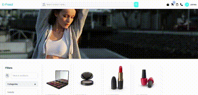
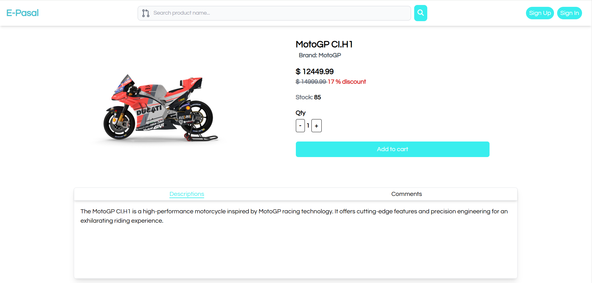
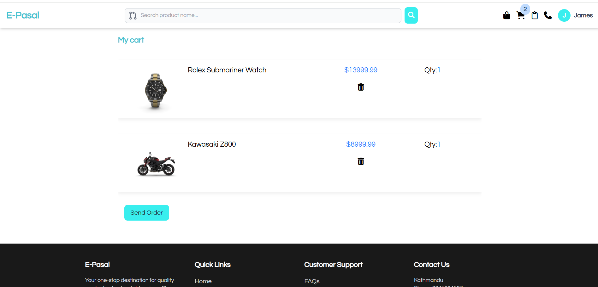

# E-Pasal


Discover a world of convenience and endless choices at e-pasal, your go-to online marketplace. Built with cutting-edge technology, including React for a seamless user experience and Rails for robust backend operations, e-pasal offers a smooth and efficient shopping journey. A modern and responsive e-commerce website where you can purchase your favourite products easily.

### Features



- A sleek looking design throughout the project along with pagination.
- Search and filter functionality to find the product quickly.
- Details page for each product.
- A cart feature to store your product you want to buy.




## Usage

You can download the zip file to use the project or you can clone this repo:

```bash
https://github.com/ShirajShrestha/e-pasal-vite-.git
```

Navigate to the folder using:

```bash
cd e-pasal-vite-
```

Install all the dependencies using following command:

```bash
npm install
```

Run the project using

```bash
npm run dev
```

## Contributing

Bug reports and pull requests are welcome on GitHub at https://github.com/ShirajShrestha/e-pasal-vite-
